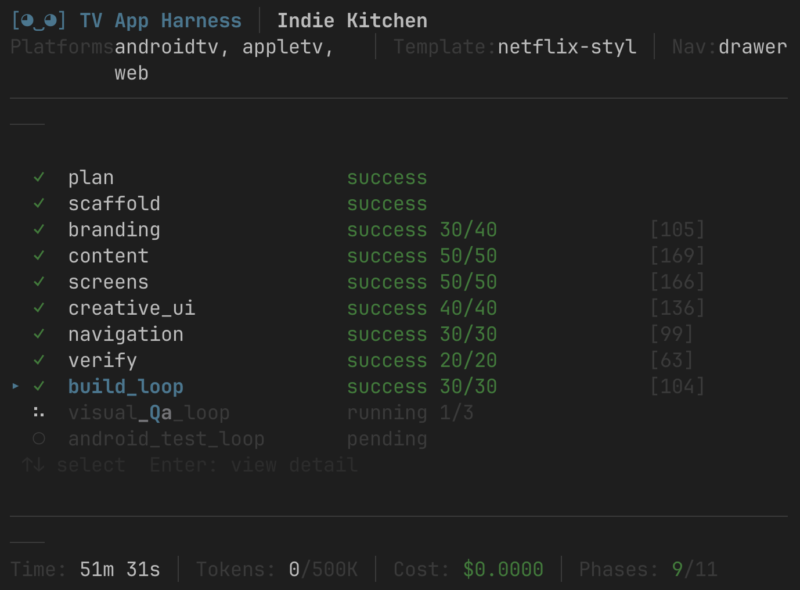

# TV Build

You feed it a JSON with your content and some brand colors. It spits out a multi-platform TV app that actually works. D-pad navigation, proper focus states, the whole thing.

Supports **React Native** (Android TV, Apple TV, Fire TV, web) and **Kotlin Multiplatform** (Compose TV). No templates that look like every other app. Each run produces something visually distinct.

<!-- TODO: hero screenshot/gif here -->

## Why

TV apps need spatial navigation, 10-foot UI design, focus management, platform-specific builds for Android TV / Apple TV / Fire TV / web. And you still want each one to look unique.

TV Build handles all of that. It uses an LLM to plan and build the app phase by phase, but the pipeline itself is deterministic: proven template, mechanical checks, git commits between phases, automated visual QA at the end.

## Quick start

```bash
cd packages/harness
yarn install
npx tsx src/index.ts doctor                             # check you have what you need
npx tsx src/index.ts claude-run --example cooking-shows # go
```



## Make your own

Create a folder. Minimum you need `content.json`:

```json
{
  "title": "My App",
  "categories": [
    { "id": "trending", "name": "Trending", "items": ["v1", "v2"] }
  ],
  "videos": [
    {
      "id": "v1",
      "title": "Some Video",
      "description": "It's good",
      "thumbnail_url": "https://...",
      "stream_url": "https://...",
      "stream_type": "hls",
      "tags": ["drama"]
    }
  ],
  "featured": ["v1"]
}
```

Add `brand.json` if you want specific colors:
```json
{
  "name": "My App",
  "primary_color": "#6C5CE7",
  "accent_color": "#00CEC9",
  "background_color": "#0A0A12"
}
```

Add `prompt.txt` if you want to describe the vibe in plain English:
```
Dark and cinematic. Neon accent glows on focus. Editorial typography.
The hero section should feel like a movie premiere.
```

Then run:
```bash
npx tsx src/index.ts claude-run /path/to/your-folder
```

## What it does, step by step

```
content.json ─┐
brand.json   ─┼─► plan → scaffold → brand → content → screens
prompt.txt   ─┘   → creative_ui → navigation → verify → build → visual QA
```

Each phase runs independently, gets verified, and commits to git. If something fails you can resume from that point.

| Phase | What happens |
|-------|-------------|
| plan | Reads your inputs, decides on screens and navigation structure |
| scaffold | Clones the RN TV template, installs deps |
| branding | Your colors everywhere, surface hierarchy, app name |
| content | Wires your data into hooks the screens actually use |
| screens | Customizes existing screens or creates new ones |
| creative_ui | Typography, focus animations, atmospheric effects. The personality. |
| navigation | Drawer or tabs, focus isolation between screens |
| verify | TSC, focus checks, platform guards |
| build_loop | Web build, native prebuild |
| visual_qa_loop | Screenshots every screen, grades them, fixes issues |
| android_test_loop | D-pad testing on an emulator |

## Resume when things fail

```bash
# Pick up where it stopped
npx tsx src/index.ts claude-run --resume

# Re-run from a specific phase
npx tsx src/index.ts claude-run --resume abc123 --from-phase verify

# Just generate, skip build/QA
npx tsx src/index.ts claude-run --example cooking-shows --generate-only
```

## Examples

| Name | What's in it | Vibe |
|------|-------------|------|
| `cooking-shows` | Indie cooking videos | Warm, editorial, Playfair Display |
| `music-videos` | Music streaming | Neon glow, glass cards |
| `fitness-tv` | Workouts | Sharp, athletic, geometric |
| `sports-live` | Live sports | High-energy, diagonal cuts |
| `nintendo-games` | Real Nintendo games (from their API) | Playful, red accent, game-box feel |
| `kmp-cooking-shows` | Same content, Kotlin Multiplatform | Compose TV output |

The `nintendo-games` example pulls real data:
```bash
cd examples/nintendo-games && node fetch-content.js
```

## Two modes

| | Command | What it uses |
|---|---------|-------------|
| **Recommended** | `claude-run` | Claude CLI as a subprocess. Stable. |
| **Multi-provider** | `run` | Strands Agents SDK. Use for OpenRouter, Bedrock, OpenAI, etc. |

For multi-provider, configure `harness.config.json`:
```json
{
  "models": {
    "strandsProvider": {
      "provider": "openrouter",
      "modelId": "anthropic/claude-sonnet-4"
    }
  }
}
```

Supported: Bedrock (`AWS_PROFILE`), Anthropic (`ANTHROPIC_API_KEY`), OpenRouter (`OPENROUTER_API_KEY`), OpenAI (`OPENAI_API_KEY`).

You can use different models per phase:
```json
{
  "models": {
    "strandsProvider": { "provider": "openrouter", "modelId": "deepseek/deepseek-v4-flash" },
    "phaseModels": {
      "visual_qa_loop": { "provider": "openrouter", "modelId": "anthropic/claude-sonnet-4" }
    }
  }
}
```

## How skills work

The core idea behind TV Build is **thin harness, fat skills**. The pipeline is intentionally simple: run phases in order, check results, retry or move on. All the domain expertise lives in skills: markdown files that teach the LLM how to actually build TV apps.

Each phase gets relevant skills loaded alongside it. They cover things like:

- How react-tv-space-navigation works (focus roots, D-pad events, overflow traps)
- TV color physics (panels over-saturate, desaturate your palette)
- Cinematic scrim patterns for hero sections
- Why items-per-rail matters when every click is sequential

Skills are loaded on demand, not dumped into the system prompt. The harness stays generic and small; the skills carry all the knowledge. You can swap skills, add your own, or point at a different template. The pipeline doesn't care.

## Output

```
out/<runId>/
├── app/                   # The app. One git commit per phase.
├── spec.json              # What the planner decided
├── checkpoint.json        # For --resume
├── report.md              # What passed, what failed, cost
├── screenshots/           # Visual QA captures
└── prompt-<phase>.md      # What the LLM actually saw (debugging)
```

## Pipeline customization

You can swap the template, add custom phases, change retry counts:

```json
{
  "template": { "repo": "https://github.com/you/your-template.git" },
  "tokenBudget": 500000,
  "phases": [
    { "name": "branding", "retries": 3 },
    {
      "name": "analytics",
      "prompt": "analytics",
      "insertAfter": "content",
      "verify": [{ "type": "grep", "pattern": "trackScreenView", "path": "packages/shared-ui/" }]
    }
  ]
}
```

## All the CLI flags

| Command / Flag | |
|---|---|
| `run [dir]` | Full pipeline (Strands SDK) |
| `claude-run [dir]` | Full pipeline (Claude CLI) |
| `doctor [--fix]` | Check prerequisites |
| `visual-qa` | Re-run visual QA on existing app |
| `test-ui` | Open app in a browser you can watch |
| `--resume [runId]` | Continue from checkpoint |
| `--from-phase <name>` | Jump to a phase |
| `--generate-only` | No build, no QA |
| `--no-tui` | Plain output |

## Verification suite

There's a separate package for measuring harness quality statistically:

```bash
cd packages/verification
npx tsx src/cli.ts run --spec=GS-01-simple
```

Runs N times, computes Wilson confidence intervals, detects regressions. See its own README.

## Repo layout

```
├── packages/harness/      # The pipeline
├── packages/verification/ # Quality measurement
├── skills/                # Domain knowledge per phase
├── examples/              # Input examples
└── docs/
```

## Development

```bash
cd packages/harness
yarn install
yarn typecheck
npx vitest run
```

## License

[MIT-0](LICENSE)
