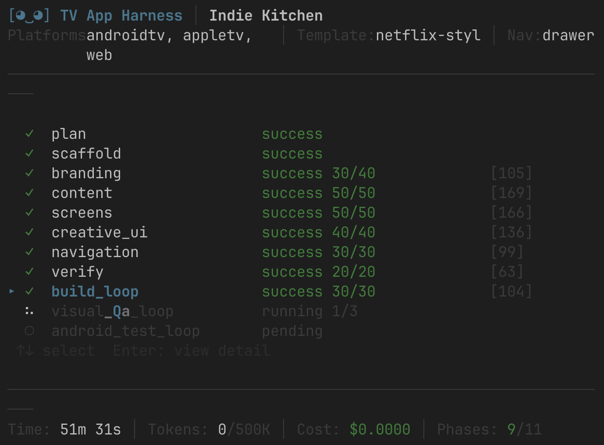

# TV Build

[](https://github.com/giolaq/tv-build-harness/actions/workflows/ci.yml)

You feed it a JSON with your content and some brand colors. It spits out a multi-platform TV app that actually works. D-pad navigation, proper focus states, the whole thing.

Supports **React Native** (Android TV, Apple TV, Fire TV, web) and **Kotlin Multiplatform** (Compose TV). No templates that look like every other app. Each run produces something visually distinct.



## Why

TV apps need spatial navigation, 10-foot UI design, focus management, platform-specific builds for Android TV / Apple TV / Fire TV / web. And you still want each one to look unique.

TV Build handles all of that. It uses an LLM to plan and build the app phase by phase, but the pipeline itself is deterministic: proven template, mechanical checks, git commits between phases, automated visual QA at the end.

## Supported platforms

Use macOS or Linux for supported local development and workshop runs. Native Windows is not supported; use WSL2 with the repo checked out inside the Linux filesystem.

Course exercises use the web target by default. Android TV, Apple TV, Fire TV, and Vega OS builds are optional platform passes after the web run works. Budget 45-90 minutes for native emulator, simulator, SDK, or device setup.

## Quick start

```bash
cd packages/harness
yarn install
npx tsx src/index.ts doctor                             # check you have what you need
npx tsx src/index.ts claude-run --example cooking-shows # go
```

## Make your own

Create a folder. Minimum you need `content.json`:

```json
{
  "title": "My App",
  "categories": [
    { "id": "trending", "name": "Trending", "items": ["v1", "v2"] }
  ],
  "videos": [
    {
      "id": "v1",
      "title": "Some Video",
      "description": "It's good",
      "thumbnail_url": "https://...",
      "stream_url": "https://...",
      "stream_type": "hls",
      "tags": ["drama"]
    }
  ],
  "featured": ["v1"]
}
```

Add `brand.json` if you want specific colors:
```json
{
  "name": "My App",
  "primary_color": "#6C5CE7",
  "accent_color": "#00CEC9",
  "background_color": "#0A0A12"
}
```

Add `prompt.txt` if you want to describe the vibe in plain English:
```
Dark and cinematic. Neon accent glows on focus. Editorial typography.
The hero section should feel like a movie premiere.
```

Then run:
```bash
npx tsx src/index.ts claude-run /path/to/your-folder
```

## Driving tv-build from an AI agent

Give the agent `AGENTS.md` and have it use the CLI contract instead of guessing file shapes:

```bash
cd packages/harness
npx tsx src/index.ts schema --json
npx tsx src/index.ts init my-inputs
npx tsx src/index.ts validate my-inputs --json
npx tsx src/index.ts claude-run my-inputs --plan --json
# Show the human the plan and cost cap.
npx tsx src/index.ts claude-run my-inputs --detach --yes --json --max-cost 10
npx tsx src/index.ts status <runId> --json
```

See `AGENTS.md` for the full contract and `docs/course/07-your-harness-as-a-tool.md` for the lesson.

For local validation, release smoke, and workshop checks, use `docs/run-and-test.md`.

Agent-facing features added in v0.3:

- `schema` prints the input contract on demand, including JSON Schema with `--json`.
- `init` scaffolds a valid input directory or copies an existing example.
- `validate --json` returns schema errors plus semantic warnings such as sparse rails, weak contrast, insecure image URLs, and instruction-like content.
- `--plan --json` lets an agent show the resolved phases and cost estimate before it starts work.
- `--detach --yes --json` starts long runs in the background, while `status`, `logs`, and `abort` let an agent supervise the run without holding a terminal open.
- Every machine-readable payload includes `schemaVersion: 1`; errors include `code`, `message`, and `hint`.
- `--max-cost` enforces a hard spend cap, and non-example runs default to a `$10` cap.
- `--seed` records creative randomness so fixtures, golden runs, and demos are repeatable.

## What it does, step by step

```
content.json ─┐
brand.json   ─┼─► plan → scaffold → brand → content → screens
prompt.txt   ─┘   → creative_ui → navigation → verify → build → visual QA
```

Each phase runs independently, gets verified, and commits to git. If something fails you can resume from that point.

| Phase | What happens |
|-------|-------------|
| plan | Reads your inputs, decides on screens and navigation structure |
| scaffold | Clones the RN TV template, installs deps |
| branding | Your colors everywhere, surface hierarchy, app name |
| content | Wires your data into hooks the screens actually use |
| screens | Customizes existing screens or creates new ones |
| creative_ui | Typography, focus animations, atmospheric effects. The personality. |
| navigation | Drawer or tabs, focus isolation between screens |
| verify | TSC, focus checks, platform guards |
| build_loop | Web build, native prebuild |
| visual_qa_loop | Screenshots every screen, grades them, fixes issues |
| android_test_loop | D-pad testing on an emulator |

## Resume when things fail

```bash
# Pick up where it stopped
npx tsx src/index.ts claude-run --resume

# Re-run from a specific phase
npx tsx src/index.ts claude-run --resume abc123 --from-phase verify

# Just generate, skip build/QA
npx tsx src/index.ts claude-run --example cooking-shows --generate-only
```

## Refine one concern

Use `refine` when the current app is mostly right and the feedback is scoped to one phase concern:

```bash
npx tsx src/index.ts refine <runId> --phase branding "warmer palette, larger hero cards" --plan --json
npx tsx src/index.ts refine <runId> --phase branding "warmer palette, larger hero cards" --yes --max-cost 3
```

`refine` amends the current app state. It does not rewind to the old phase commit or replay downstream phases. It inherits the original creative seed, reuses the phase's prompt context, reruns that phase's verify checks, and commits as `refine(<phase>): ...` only when the app tree is clean and the checks pass.

## Examples

| Name | What's in it | Vibe |
|------|-------------|------|
| `cooking-shows` | Indie cooking videos | Warm, editorial, Playfair Display |
| `music-videos` | Music streaming | Neon glow, glass cards |
| `fitness-tv` | Workouts | Sharp, athletic, geometric |
| `sports-live` | Synthetic live sports | High-energy, diagonal cuts |
| `nintendo-games` | Synthetic game catalog; optional local fetch script | Playful, storefront feel |
| `kmp-cooking-shows` | Same content, Kotlin Multiplatform | Compose TV output |

The committed `nintendo-games` content is synthetic. Its optional fetch script writes ignored local output:
```bash
cd examples/nintendo-games && node fetch-content.js
```

## Two modes

| | Command | What it uses |
|---|---------|-------------|
| **Recommended** | `claude-run` | Claude CLI as a subprocess. Stable. |
| **Multi-provider** | `run` | Strands Agents SDK. Use for OpenRouter, Bedrock, OpenAI, etc. |

For multi-provider, configure `harness.config.json`:
```json
{
  "models": {
    "strandsProvider": {
      "provider": "openrouter",
      "modelId": "anthropic/claude-sonnet-4"
    }
  }
}
```

Supported: Bedrock (`AWS_PROFILE`), Anthropic (`ANTHROPIC_API_KEY`), OpenRouter (`OPENROUTER_API_KEY`), OpenAI (`OPENAI_API_KEY`).

You can use different models per phase:
```json
{
  "models": {
    "strandsProvider": { "provider": "openrouter", "modelId": "deepseek/deepseek-v4-flash" },
    "phaseModels": {
      "visual_qa_loop": { "provider": "openrouter", "modelId": "anthropic/claude-sonnet-4" }
    }
  }
}
```

## How skills work

The core idea behind TV Build is **thin harness, fat skills**. The pipeline is intentionally simple: run phases in order, check results, retry or move on. All the domain expertise lives in skills: markdown files that teach the LLM how to actually build TV apps.

Each phase gets relevant skills loaded alongside it. They cover things like:

- How react-tv-space-navigation works (focus roots, D-pad events, overflow traps)
- TV color physics (panels over-saturate, desaturate your palette)
- Cinematic scrim patterns for hero sections
- Why items-per-rail matters when every click is sequential

Skills are loaded on demand, not dumped into the system prompt. The harness stays generic and small; the skills carry all the knowledge. You can swap skills, add your own, or point at a different template. The pipeline doesn't care.

## Output

```
out/<runId>/
├── app/                   # The app. One git commit per phase.
├── spec.json              # What the planner decided
├── checkpoint.json        # For --resume
├── run.log                # Detached run logs
├── pid                    # Detached process id while running
├── report.md              # What passed, what failed, cost
├── recording.json         # Replayable model transcript when recording is enabled
├── screenshots/           # Visual QA captures
└── prompt-<phase>.md      # What the LLM actually saw (debugging)
```

Reports and recordings include the creative seed used for the run. `replay <file|fixture-name>` uses stored turns and does not require `ANTHROPIC_API_KEY` or the Claude CLI.

## Pipeline customization

You can swap the template, add custom phases, change retry counts:

```json
{
  "template": {
    "repo": "https://github.com/you/your-template.git",
    "commit": "0123456789abcdef0123456789abcdef01234567"
  },
  "tokenBudget": 500000,
  "phases": [
    { "name": "branding", "retries": 3 },
    {
      "name": "analytics",
      "prompt": "analytics",
      "insertAfter": "content",
      "verify": [{ "type": "grep", "pattern": "trackScreenView", "path": "packages/shared-ui/" }]
    }
  ]
}
```

## All the CLI flags

| Command / Flag | |
|---|---|
| `run [dir]` | Full pipeline (Strands SDK) |
| `claude-run [dir]` | Full pipeline (Claude CLI) |
| `refine <runId\|appDir> "..."` | Amend one phase concern on the current app state |
| `replay <file\|fixture>` | Replay a recorded run without a model key |
| `schema [name]` | List schemas or print one input schema |
| `init <dir>` | Scaffold an input directory |
| `validate <dir>` | Validate inputs and print semantic warnings |
| `status <runId>` | Read detached run state |
| `logs <runId> [--follow]` | Print or follow detached run logs |
| `abort <runId>` | Stop a detached run |
| `templates check` | Compare pinned template commits with upstream HEAD |
| `doctor [--fix]` | Check prerequisites |
| `vega-doctor [--fix]` | Check Kepler, VDA, Vega manifest, and Amazon Devices Builder Tools |
| `visual-qa` | Re-run visual QA on existing app |
| `test-ui` | Open app in a browser you can watch |
| `--resume [runId]` | Continue from checkpoint |
| `--from-phase <name>` | Jump to a phase |
| `--generate-only` | No build, no QA |
| `--no-tui` | Plain output |
| `--json` | Emit versioned JSON or NDJSON with human logs on stderr |
| `--plan` | Print resolved phases and estimate without running them |
| `--detach` | Start a run in the background |
| `--yes` | Confirm a detached JSON run after the human has seen the plan |
| `--max-cost <usd>` | Abort cleanly when model cost exceeds the cap |
| `--seed <value>` | Fix creative constraints for repeatable output |
| `--from-example <name>` | Use an example as the `init` starting point |

## Vega optimization

When `firetv-vega` is targeted, the pipeline adds Vega-specific phases:

- `vega_setup_check`: validates Kepler, VDA, Amazon Devices Builder Tools MCP, the Vega manifest, and non-portable shared UI imports.
- `vega_build_loop`: builds the Kepler/Vega app.
- `vega_qa_loop`: installs, launches, screenshots, and D-pad tests on the Vega Virtual Device.
- `vega_perf_trace`: uses Amazon Devices Builder Tools `analyze_perfetto_traces` when available.
- `vega_hot_functions`: uses Amazon Devices Builder Tools `get_app_hot_functions` when available.

Configure budgets in `harness.config.json`:

```json
{
  "vega": {
    "ttff_ms_max": 1500,
    "ttfd_ms_max": 3000,
    "max_hot_function_percent": 20,
    "max_js_frame_drop_percent": 2
  }
}
```

## Verification suite

There's a separate package for measuring harness quality statistically when you fund repeated runs:

```bash
cd packages/verification
npx tsx src/cli.ts run --spec=GS-01-simple
```

It is the instrument for N-run pass-rate measurement, Wilson confidence intervals, and regression detection. This repo does not publish pass-rate claims until a real batch has been run; see `docs/pass-rates.md` for the publication rules.

## Repo layout

```
├── packages/harness/      # The pipeline
├── packages/verification/ # Quality measurement
├── skills/                # Domain knowledge per phase
├── examples/              # Input examples
└── docs/
```

## Development

```bash
cd packages/harness
yarn install
yarn typecheck
npx vitest run
```

## License

[MIT-0](LICENSE)
