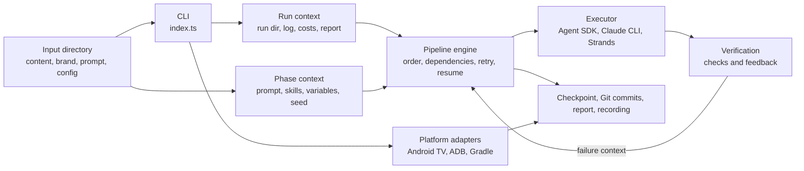

# TV Build Technical Architecture

TV Build separates deterministic orchestration from model-specific execution.
The harness decides *what phase runs next*, which checks gate it, how retries
work, and how state is written. An executor decides *how a model is called*.
This boundary makes the pipeline testable and lets the same phase plan run with
the Claude Agent SDK, Claude CLI, or Strands.



## Entry point and command contract

`packages/harness/src/index.ts` is the CLI entry point. It parses commands,
selects the orchestrator/executor mode, and delegates command-specific behavior.

The CLI has two output modes:

- Human mode prints a readable progress view.
- `--json` uses single JSON objects for short commands and NDJSON events for
  long-running commands.

Every JSON payload carries `schemaVersion: 1`. This makes the CLI a stable
integration surface for coding agents and the verification package. Exit codes
identify input errors, run failures, environment failures, and aborts without
parsing prose.

Relevant modules:

| Responsibility | Module |
| --- | --- |
| CLI and command routing | `packages/harness/src/index.ts` |
| JSON/NDJSON output and exit codes | `packages/harness/src/output.ts` |
| Detached run status, log tails, abort | `packages/harness/src/status.ts` |
| Input validation and semantic warnings | `packages/harness/src/validate.ts` |
| Input schema definitions | `packages/harness/src/input-schemas.ts` |

## Inputs and planning

The harness treats structured inputs as a strong prior. `content.json` and
`brand.json` carry facts; `prompt.txt` carries intent and taste. Optional
configuration supplies templates, models, custom phases, verification checks,
and budgets.

`harness-config.ts` resolves a `PhaseSpec[]` plan. Each phase declares prompt
sources, skills, dependencies, and checks. The plan is deterministic once the
inputs and creative seed are fixed.

`phase-prompts.ts` provides creative constraints. A seed is selected per run,
stored in the run records, and included in prompt assembly. Fixed seeds make
fixtures, golden runs, and statistical verification comparable.

## The pipeline engine

`pipeline-engine.ts` owns control flow. It selects runnable phases, honors
dependencies, runs verification, retries a failed phase with failure context,
and resumes from checkpoints.

It does not know which model SDK is in use. It receives phase results through a
small executor boundary. This is the core design choice: model behavior changes
often; phase control flow should remain deterministic and easy to test.

The usual phase lifecycle is:

```text
resolve phase -> build prompt/context -> execute -> verify
  -> pass: commit and checkpoint
  -> fail: add failure details and retry once
  -> fail again: record a failed run
```

## Context, prompts, skills, and tools

`run-context.ts` sets up the run directory, `RunLog`, cost accumulator, input
state, and final report. It is the durable run-level boundary.

`phase-context.ts` creates the prompt passed to the model. It combines the
phase's original prompt, template/config information, input variables, the
creative seed, and skill bodies. The skills live in `skills/<name>/SKILL.md` and
are loaded through `skill-library.ts`.

Executors may expose tools. The tool registries and tool modules give the model
bounded capabilities such as cloning a template, changing theme data, injecting
content, adding a screen, running checks, capturing screenshots, and making Git
commits. Tools are explicit code, not shell instructions hidden in a prompt.

| Responsibility | Module |
| --- | --- |
| Run setup, costs, finalization | `packages/harness/src/run-context.ts` |
| Phase prompt construction | `packages/harness/src/phase-context.ts` |
| Skills | `packages/harness/src/skill-library.ts` and `skills/*/SKILL.md` |
| Tool registration | `packages/harness/src/tool-registry.ts` |
| Individual tool implementations | `packages/harness/src/tools/` |

## Executors

Three thin executors adapt model runtimes to the shared engine:

| Runtime | Executor | Intended use |
| --- | --- | --- |
| Claude Agent SDK | `src/executors/agent-sdk.ts` | Tool-rich agent execution through the SDK. |
| Claude CLI | `src/executors/claude-cli.ts` | CLI subprocess execution and stream parsing. |
| Strands | `src/executors/strands.ts` | Multi-provider orchestration path. |

The executors return a common phase result: completion status, output, cost,
token use, timings, and errors. The engine uses this result rather than SDK
specific objects.

`recorder.ts` can persist model turns using a shared `RecordedTurn` format.
`ReplayClient` reads those turns to reproduce a run without an API key.

## Verification and recovery

`verification.ts` runs declarative phase checks. A check may verify files,
commands, generated output, or expected text. The engine supplies the check
failure to the retry prompt so the model receives a precise correction task.

The generated application is committed after successful phases. Checkpoints
store progress and allow resume without replaying completed work. Reports and
logs make the run inspectable after the fact.

The separate `packages/verification` package evaluates the harness itself over
batches of runs. It consumes the versioned JSON CLI contract, uses fixed or
random seed policies deliberately, enforces batch budgets, and guards against
comparisons made across different models, templates, or judge configurations.

## Focused iteration: refine

`refine.ts` is a one-phase iteration path. It resolves an existing app and its
originating run, inherits the original seed and phase context, and applies a new
instruction to the current application state. It creates a guard branch, runs
the phase checks, retries once on verification failure, and merges/commits only
on success.

This deliberately amends the current state instead of rewinding to an old
phase. A rewind could discard later phases and manual developer edits.

## Android TV and Android Studio handoff

The Android lifecycle is deliberately outside the model executor. It is a
deterministic platform adapter that prefers the official Android CLI:

```text
tv-build android -> android describe -> discover/wait for device -> Gradle build
  -> android run -> D-pad input -> android layout/screen capture -> handoff JSON
```

`commands/android.ts` translates CLI flags into a lifecycle plan.
`platforms/android-tv.ts` invokes `android describe`, `android run`,
`android layout`, and `android screen capture` through the bounded process
runner in `process/command-runner.ts`. The project-owned Gradle wrapper remains
responsible for compilation. ADB is a narrow compatibility surface for
connected-device discovery, boot status, D-pad input, and Logcat, which Android
CLI does not currently expose. `platforms/dpad-flow.ts` executes optional focus
assertions against Android CLI layout data.

`--setup-agent` runs `android init` and verifies the installed Android CLI skill.
`--require-android-cli` makes missing CLI tooling an environment failure;
otherwise the adapter records that it used its Gradle/ADB compatibility path.

The command writes `android-handoff.json` beside the run. That file gives a
developer the exact project directory, module, variant, Gradle tasks, APK path,
device serial, artifacts, and latest failure to continue debugging in Android
Studio.

See `docs/android-cli-workflow.md` for the operational and presentation-facing
view of this architecture.

## Operational safety

- Model cost is tracked in events and reports; live runs are uncapped.
- The configured token budget can stop work between phases.
- Template refs are SHA-pinned and can be checked against upstream.
- Detached runs write a PID, log, checkpoint, and state that `status` reads.
- Safe process execution uses argument arrays rather than a shell.
- Inputs receive semantic lint warnings for content density, contrast, insecure
  links, and instruction-like content.
- Recordings, fixtures, and docs are scrubbed for local paths and secrets.

## Where to change behavior

| Change | Start here |
| --- | --- |
| Add or alter a pipeline phase | `packages/harness/src/harness-config.ts` |
| Add a verification check | `packages/harness/src/verification.ts` and phase config |
| Add TV/domain knowledge | `skills/<name>/SKILL.md` |
| Add an executor runtime | `packages/harness/src/executors/` |
| Add a CLI command | `packages/harness/src/index.ts` |
| Add Android lifecycle behavior | `packages/harness/src/platforms/android-tv.ts` |
| Evaluate reliability across runs | `packages/verification/` |
