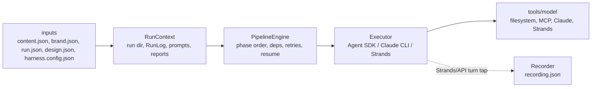

# Harness Architecture

The harness is phase-driven. Keep deterministic control flow in the shared engine and keep model/runtime differences inside executors.

## Files

| Area | File |
| --- | --- |
| Phase engine | `src/pipeline-engine.ts` |
| Run setup and final reports | `src/run-context.ts` |
| Prompt and skill context | `src/phase-context.ts` |
| Agent SDK executor | `src/executors/agent-sdk.ts` |
| Claude CLI executor | `src/executors/claude-cli.ts` |
| Strands executor | `src/executors/strands.ts` |
| Agent SDK MCP tools | `src/agent-sdk-tools.ts` |

Deprecated compatibility paths remain for one release:

- `src/orchestrator.ts`
- `src/claude-orchestrator.ts`
- `src/strands-orchestrator.ts`

New code should import from `src/executors/*`.

## Android tooling

The Android phase and `tv-build android` command prefer the official Android
CLI. `src/platforms/android-tv.ts` uses `android describe`, `android run`,
`android emulator start`, `android layout`, and `android screen capture`.
Metadata emitted by `android describe` overrides guessed APK paths. Gradle
remains responsible for building APKs. ADB is limited to connected-device
discovery, boot state, D-pad input, and Logcat because Android CLI does not
currently expose those actions.

Run `android init` directly or pass `--setup-agent` to install/update the
official `android-cli` agent skill. Pass `--require-android-cli` when a run must
fail instead of using the Gradle/ADB compatibility backend.
