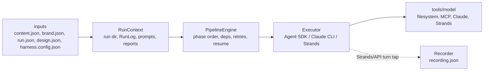

# Harness Architecture

The harness is phase-driven. Keep deterministic control flow in the shared engine and keep model/runtime differences inside executors.

## Files

| Area | File |
| --- | --- |
| Phase engine | `src/pipeline-engine.ts` |
| Run setup and final reports | `src/run-context.ts` |
| Prompt and skill context | `src/phase-context.ts` |
| Agent SDK executor | `src/executors/agent-sdk.ts` |
| Claude CLI executor | `src/executors/claude-cli.ts` |
| Strands executor | `src/executors/strands.ts` |
| Agent SDK MCP tools | `src/agent-sdk-tools.ts` |

Deprecated compatibility paths remain for one release:

- `src/orchestrator.ts`
- `src/claude-orchestrator.ts`
- `src/strands-orchestrator.ts`

New code should import from `src/executors/*`.
